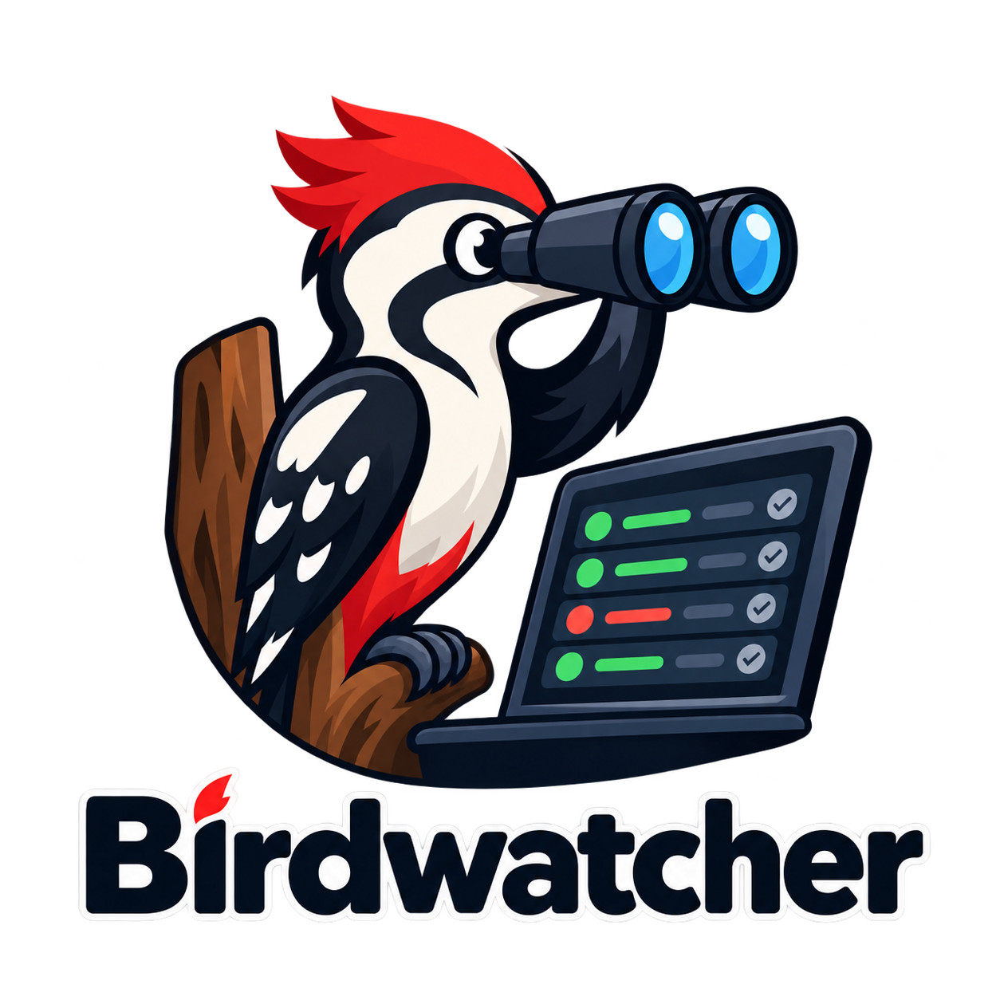

<p align="center"></p>

# Birdwatcher

A status board for [Woodpecker CI](https://woodpecker-ci.org) that turns the
open pull requests of your repositories into one plan: who owes which move so
that the queue drains. It runs inside the Woodpecker UI on the viewer's own
session, or standalone as a static page.

On top, the latest build of the default branch and every cron job; below it
three tabs.

- **Actions** (default) — the plan for the logged-in GitHub login: what each of
  their open PRs is blocked on and what they owe others as a reviewer, one
  imperative heading per bucket with the PRs under it. The buckets, first match
  wins: draft with red CI → *fix or close*; ready PR with red CI → *fix CI*;
  pipeline waiting for manual approval → *approve it* (admins only); no
  pipeline on the head commit, or only a skipped / cancelled one → *rerun
  CI*; nothing from the author for 14+ days → *revive or close* (this comes
  before "do not merge", so a parked PR is parked for two weeks at most);
  stacked on a branch no open PR carries any more → *retarget to main*;
  conflicts with main → *rebase*; approved and behind → *rebase*; approved,
  green, mergeable, every thread answered → *merge*; approved and green but
  GitHub still blocks the merge (branch protection: a second approval, a
  CODEOWNER, a required check) → the requested reviewer who hasn't approved
  owes it, otherwise the author *gets the missing approval or check*; an
  inline review thread without the author's reply, changes requested, or the
  last word is a reviewer's → *answer every review comment*; ready with nobody
  asked → *request a reviewer*; requested and unanswered for 2+ days → *ping
  the reviewers*; draft with green CI → *mark ready*; draft without CI → *run
  CI or close it*. Reviewer side: *review it* (requested, nothing from you on
  the current head) and *re-review* (the author moved after your last review,
  or the PR waits on reviewers and yours has no verdict). A push after an
  approval keeps the approval. Bots and the author never count as requested
  reviewers. "View as" shows any other login's plan.

  The matrix keeps one invariant, the board's theorem: **every open PR is
  either somebody's move (an author bucket, the admin bucket, or a reviewer
  task for a named login), or transient (CI in flight, review data loading,
  GitHub computing mergeability), or parked as "do not merge" for at most 14
  days.** So if everyone on the board does what it says, the queue drains —
  up to the review loop itself converging, which no board can promise.
  `orphan()` in `board.js` is the predicate; `tests/matrix_test.js` slices
  the matrix out of `board.js`, enumerates the whole state space (~10M
  states: draft × CI status × staleness × DNM × mergeability × branch
  protection × two reviewers' request/review/timing × author activity ×
  threads × dormancy) and fails on the first state with nobody's move. The
  "Who owes what" card shows any live exception as "unowned" — that is a
  matrix bug. `tests/timeline_test.js` guards the fold that feeds the matrix:
  a CI that posts its report comments with a human's token must not hide that
  human's reviews, review requests and inline threads, while their plain
  comments (CI narration) do not count.
- **Pull requests** — every open PR with CI status, mergeability, reviewers,
  and filters, including the same blocker buckets ("Blocked on: …").
- **Main · perf & coverage** — the benchmark baseline, the lcov coverage
  baseline, and a nightly comparison report with a night-over-night trend,
  read from a reports host (see `reports` in the config). Only for the
  primary repo and only when a reports host is configured; loaded lazily, so
  it never delays the first two tabs.

Every PR row carries a link to its ticket when the title or the branch name
holds a key of a known tracker project (`trackers` in the config), the blocker
as a link to where the action happens (the first unanswered thread, or the PR
page), the reviewers as avatars whose ring shows their latest state (green
approved, red changes requested, blue commented, dashed requested and silent),
a "waiting Nd" age for how long it has sat in that state, and "also: …" for
the secondary blockers the primary bucket hides. Sections list the
oldest-stuck PR first. The Pull requests tab opens with **Who owes what**: one
row per person with the reviews they owe, the answers, fixes, rebases, asks
and merges the queue waits on from them, and their oldest debt; clicking a row
opens that person's plan.

The default-branch strip counts only `push` pipelines, never `manual` runs. A
pipeline that Woodpecker cancelled because a newer one superseded it
(`cancel_previous_pipeline_events`) is dropped from every history strip — its
verdict is lost, so it is neither red nor counted.

The theme button cycles light → dark → Woodpecker. The Woodpecker theme uses
Woodpecker's own palette (its `--wp-*` variables when embedded, so it follows
Woodpecker's light/dark setting); embedded, it keeps the real Woodpecker
navbar and renders the board where the router view sits.

The page paints in phases (hero → PR list → per-PR review data), caches repos,
runs, mergeability and the folded review timeline in `localStorage`, patches
single pipelines from Woodpecker's event stream, and diffs every refresh
against the live DOM, so a reload shows the full plan in about a second and
nothing flickers.

## Setup

Everything site-specific lives in `config.js`, which sets
`window.BIRDWATCHER_CONFIG`. Start from the example:

```bash
cp config.example.js config.js   # then edit
```

Every key is optional; a missing one turns its feature off.

### Inside Woodpecker

Woodpecker loads a single custom script, so serve the config and the board as
one file:

```bash
cat config.js board.js > /opt/woodpecker/custom/woodpecker.js
```

```yaml
# woodpecker server
environment:
  - WOODPECKER_CUSTOM_JS_FILE=/usr/local/www/woodpecker.js
volumes:
  - /opt/woodpecker/custom:/usr/local/www:ro
```

The board renders at `<woodpecker>/birdwatcher` (`boardPath`) and adds a link
to the navbar everywhere else. Builds, crons and step logs come through the
viewer's Woodpecker session. For the GitHub-backed parts (the Actions tab,
mergeability, reviewers) put a read-only proxy at `/github/` on the Woodpecker
host that adds a GitHub token and admits only logged-in Woodpecker users (for
example Traefik ForwardAuth on Woodpecker's `/api/user`); without it the board
falls back to Woodpecker's own pull request list. The reports host is read the
same way through `reports.proxyPath`.

| Data | Source |
|---|---|
| Builds, crons, workflows, step logs | Woodpecker API, same origin |
| Open PRs, mergeability, reviewers, review timeline, inline threads | GitHub API through `/github/…` |
| Open PRs (a repo the proxy token cannot read) | Woodpecker `/api/repos/<id>/pull_requests` |
| Benchmark / coverage tables per PR | the CI's report comments (`reportMarkers`), or the `publish` / `coverage` step logs |
| Benchmark baseline, coverage baseline, nightly report | the reports host through `reports.proxyPath` |

### Standalone

Serve `index.html`, `config.js` and `board.js` side by side. The board asks
for a Woodpecker token and, optionally, a GitHub token (both stay in the
browser's `localStorage`). The reports cards work when the page is served
from the reports host itself or a reports base URL is set in settings.

## Tests

```bash
node tests/matrix_test.js     # the theorem over the whole state space (~1 min)
node tests/timeline_test.js   # the review timeline fold
```

## License

MIT
